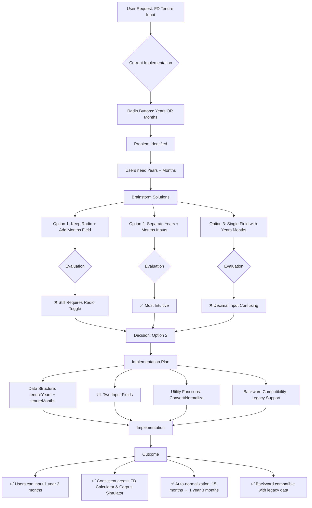
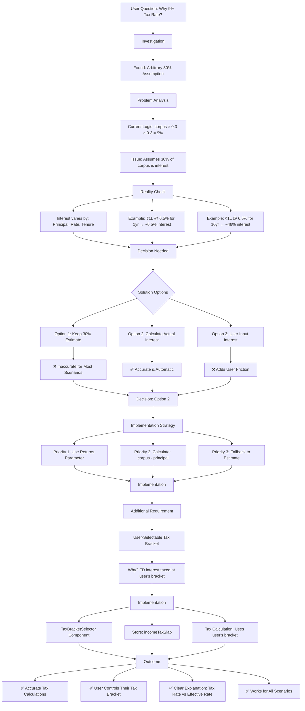
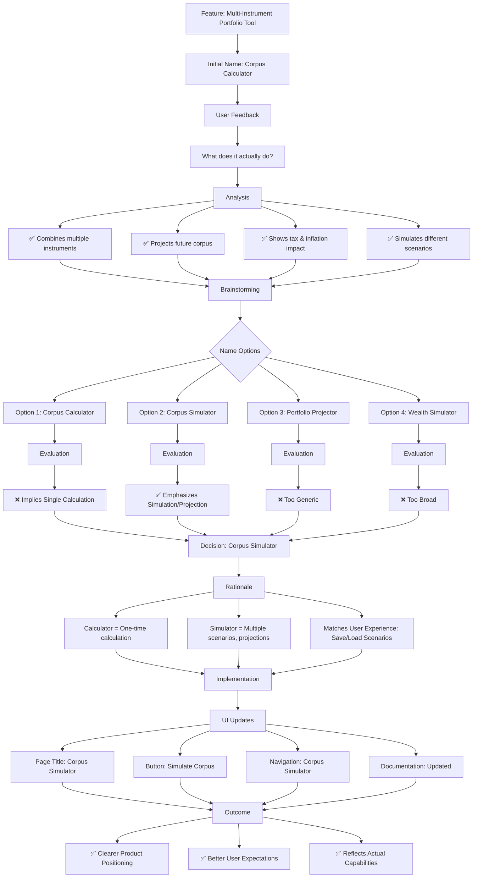
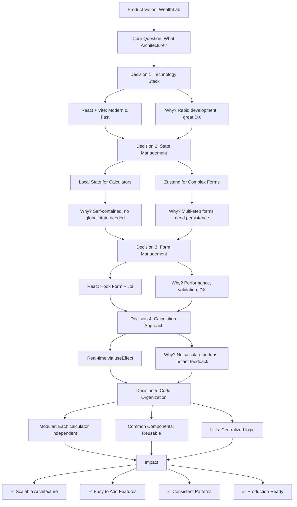
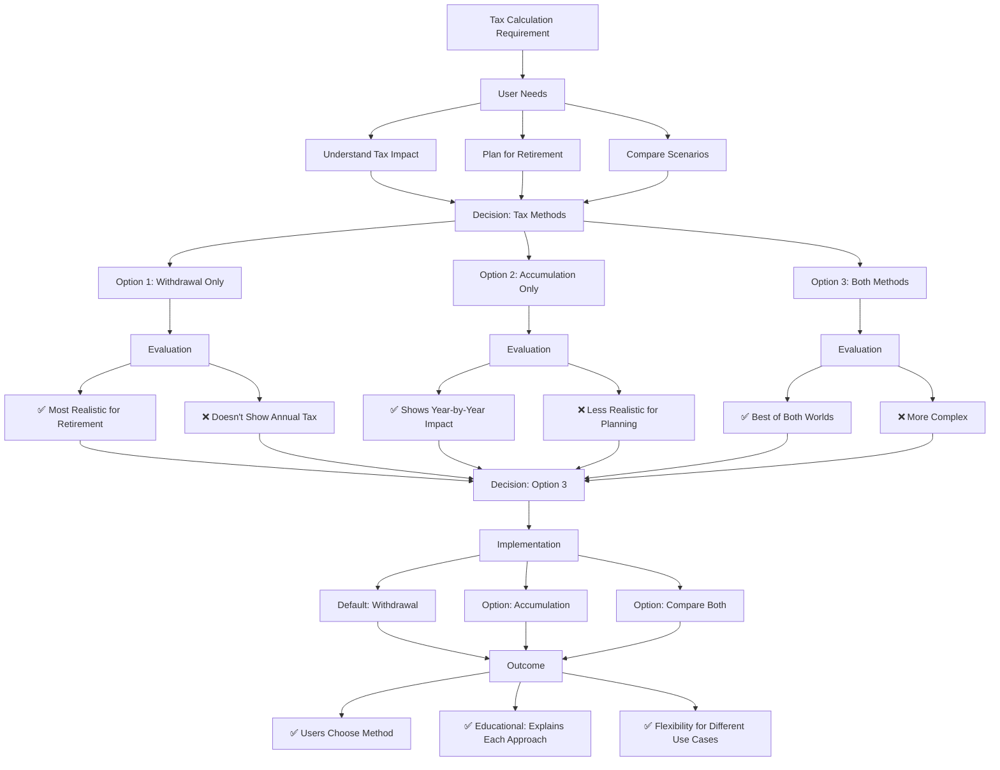

# Decision Flowcharts & Product Thinking

This document showcases the decision-making process for key product features and technical implementations. These flowcharts demonstrate how product choices were made, what alternatives were considered, and how decisions impacted the final implementation.

---

## 1. FD Tenure Input Enhancement Decision Flow

**Problem**: FD calculator used radio buttons for "Years OR Months", limiting flexibility for scenarios like "1 year 3 months".

**Key Decision Points**:
- **Why separate inputs?** Most intuitive and matches user mental model
- **Why auto-normalization?** Prevents confusion (15 months → 1 year 3 months)
- **Why backward compatibility?** Existing saved data continues to work

**Impact**: Improved user experience, accurate calculations, consistent UI across calculators.

---

## 2. Tax Calculation Accuracy Decision Flow

**Problem**: FD tax calculation used arbitrary 30% assumption, leading to incorrect "9% effective rate" mystery.

**Key Decision Points**:
- **Why calculate actual interest?** Accuracy is critical for financial planning
- **Why priority-based fallback?** Robustness - handles edge cases gracefully
- **Why user-selectable tax bracket?** Tax depends on user's income, not instrument

**Impact**: Accurate tax calculations, user trust, educational clarity (tax rate vs effective rate).

---

## 3. Corpus Simulator Naming Decision Flow

**Problem**: Initially called "Corpus Calculator" but needed a name that better reflected its simulation capabilities.

**Key Decision Points**:
- **Why "Simulator" over "Calculator"?** Emphasizes scenario modeling vs single calculation
- **Why not other names?** Simulator is specific, clear, and matches user behavior (save/load scenarios)

**Impact**: Better product positioning, clearer user expectations, matches actual functionality.

---

## 4. Overall Product Architecture Decision Flow

**High-level decisions that shaped the entire product**.

**Key Decision Points**:
- **Why React + Vite?** Modern, fast, great developer experience
- **Why local state for calculators?** Simpler, better performance, no unnecessary complexity
- **Why Zustand for complex forms?** Lightweight, perfect for multi-step forms
- **Why React Hook Form?** Performance (minimal re-renders), easy validation
- **Why real-time calculations?** Better UX, no friction

**Impact**: Scalable, maintainable, performant architecture that supports rapid feature development.

---

## 5. Tax Calculation Method Selection Flow

**Decision**: How to handle tax calculations (withdrawal vs accumulation vs both).

**Key Decision Points**:
- **Why default to withdrawal?** Most realistic for retirement planning
- **Why offer both?** Education - users learn different tax approaches
- **Why comparison mode?** Helps users understand trade-offs

**Impact**: Educational value, flexibility, better financial planning decisions.

---

## Summary: Decision-Making Principles

Throughout the development process, key principles guided decisions:

1. **User-Centric**: Every decision starts with user needs and use cases
2. **Accuracy First**: Financial calculations must be accurate (tax calculation fix)
3. **Intuitive UX**: Prefer natural, intuitive interfaces (years + months)
4. **Educational**: Help users understand financial concepts (tax methods, tax rates)
5. **Scalable**: Architecture decisions support future growth
6. **Practical**: Balance ideal solutions with implementation complexity

**These flowcharts demonstrate**:
- How problems were identified and analyzed
- What alternatives were considered
- Why specific solutions were chosen
- How decisions impacted the final product

These decisions shaped WealthLab into a powerful, accurate, and user-friendly financial planning tool.

